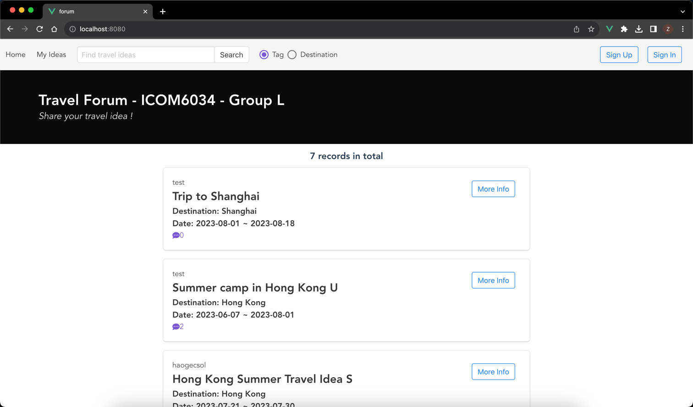
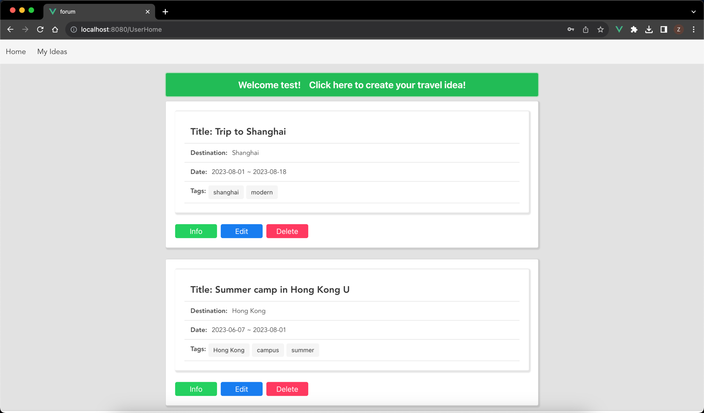
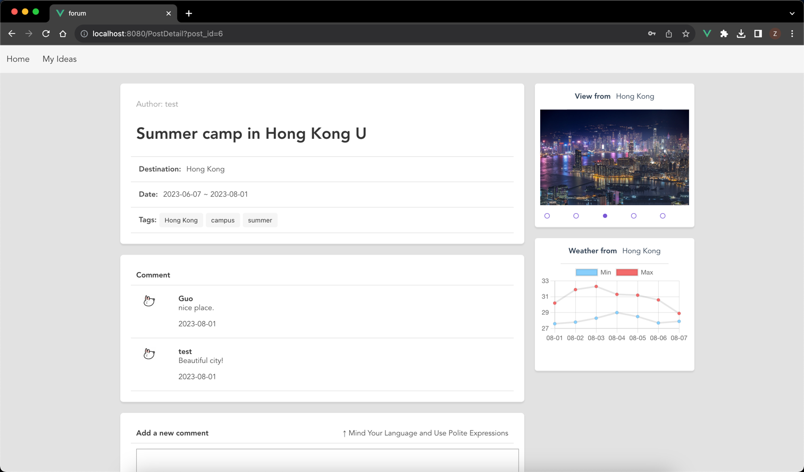

# TravelForum

`vue` `vuex` `axios` `vue-router` `buefy-ui` `Chartjs`

Backend project link：https://github.com/Bi5h0ps/TravelGo

## Project Structure

The catalog is organized into the following structure:

- `public`: This directory contains static assets that will be directly copied into the build output.

- `src`: The heart of the project, this directory contains the source code for the Vue application.
    - `api`: Explore the `index.js` file here to understand how API requests are handled.
    - `assets`: Place any static assets, such as images or fonts, in this directory.
    - `components`: Discover a variety of Vue components designed to showcase different aspects of web development.
        - `Forum`: A Vue component representing a discussion travel forum.
        - `Post`: A Vue component for displaying and interacting with travel forum ideas.
        - `User`: A Vue component that provides user-related functionalities.
        - `Login.vue`: An example of a login form using Vue.
        - `Register.vue`: An example registration form built with Vue.
    - `router`: Explore this directory to understand how Vue Router is set up for navigation.
    - `store`: Dig into the Vuex store to see how centralized state management is implemented.
    - `App.vue`: The root Vue component that forms the basis of the application's structure.
    - `main.js`: The entry point of the application where Vue is initialized.

- `package.json`: This file defines project dependencies and scripts for building, serving, and testing the application.

- `README.md`: You're reading it! This document provides an overview of the project, its structure, and how to get started.

- `vue.config.js`: Configuration options for the Vue CLI.

## Project setup
The front end project is running on the http://localhost:8080 by default.

The back end project is running on the http://localhost:9991 by default.

### Nodejs version control
```
nvm use 16
```

### Install dependencies
```
npm install
```

### Compiles and hot-reloads for development
```
npm run dev
```

### Compiles and minifies for production
```
npm run build
```

## Screenshots of the project








## License

This project is licensed under the [MIT License](LICENSE). You are free to use, modify, and distribute the code in accordance with the terms of the license.

